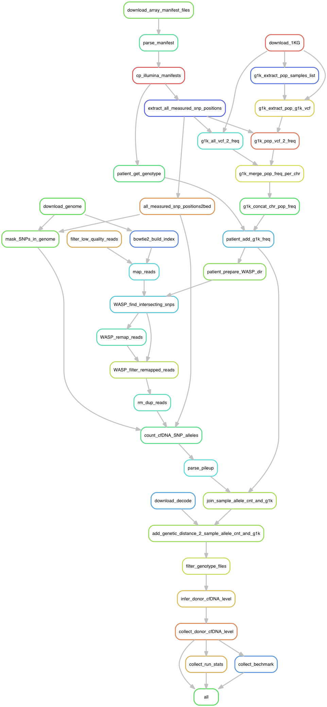

# Workflow files
1. Copy these files to the work directory
2. modify the config file to point to the scripts directory
3. Modify the config file to point to the Data directory. The data directory should contain:
  a. Patients table <set name>.recipient.genotypes.tsv (tsv with header)
  b. Samples tables <set name>.samples.tsv (tsv with header)

# Required columns in the patients table 

1. Patient - patient i.d.
2. RecArrayTypeManifest - illumina manifest 
3. RecFullTableLocal - path of illumina final report file 
4. RecFullTableID - id in final report file

# Required columns in the samples table
1. Patient - matching the patients table
2. SampleUniqueStr - unique string that can be part of a legal file name
3. SeqType ['single-end' | 'paired-end' ]
4. IsFullInfo - True / False. Only True samples will be run.
5. ReadLocal1 - path of cfDNA sequencing fatsq R1 file 
6. ReadLocal2 - path of cfDNA sequencing fatsq R2 file, if exists
7. DonorType - known relatedness of donor and recipient (check inference algorithm for allowed values. for example: 'Siblings')

# Snakemake workflow rules graph

